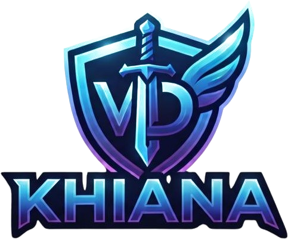
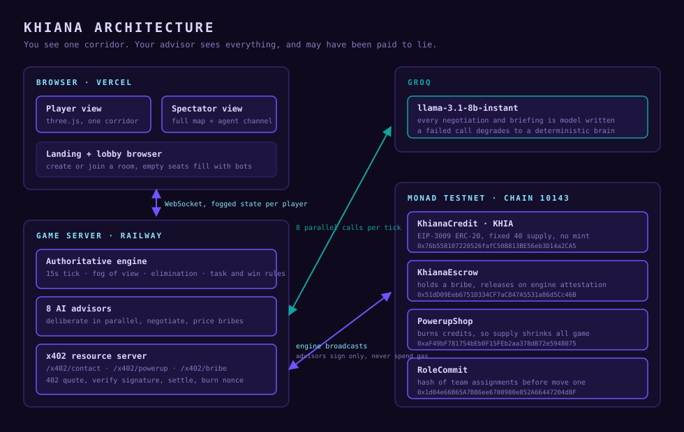

<div align="center">



# KHIANA

### You see one corridor. Your advisor sees everything.

**A first-person maze where an AI advisor guides you through the dark, and it may have been paid, on-chain, to walk you into a wall.**

[](https://khiana.vercel.app)
[](https://testnet.monadscan.com/)
[](https://docs.monad.xyz/guides/x402)

**[khiana.vercel.app](https://khiana.vercel.app)**

</div>

---

## Architecture

<div align="center">

</div>

---

## Contracts

All four are live on **Monad testnet (chain 10143)**.

| Contract | Address | What it does |
|---|---|---|
| **KhianaCredit** | [`0x76b558107220526fafC50B813BE56eb3D14a2CA5`](https://testnet.monadscan.com/address/0x76b558107220526fafC50B813BE56eb3D14a2CA5) | The KHIA token. EIP-3009 ERC-20, fixed 40 supply, no mint. x402's `exact` scheme settles through an ERC-20 method, so native MON is rejected by the facilitator. MON is the gas; KHIA is the payload. |
| **KhianaEscrow** | [`0x51dD09Eeb6751D334CF7aC847A5531a86d5Cc46B`](https://testnet.monadscan.com/address/0x51dD09Eeb6751D334CF7aC847A5531a86d5Cc46B) | Holds a conditional bribe and releases it only when the engine attests delivery. Makes "I pay you on delivery" enforceable between agents with no reason to trust each other. |
| **PowerupShop** | [`0xaF49bF781754bEb0F15FEb2aa378dB72e5948075`](https://testnet.monadscan.com/address/0xaF49bF781754bEb0F15FEb2aa378dB72e5948075) | Sells the twelve powerups and burns the credits, so the money supply visibly shrinks across a round. |
| **RoleCommit** | [`0x1d04e66B65A7B86ee6700980e852A66447204d8F`](https://testnet.monadscan.com/address/0x1d04e66B65A7B86ee6700980e852A66447204d8F) | Publishes a hash of the team assignments before the first move and opens it at the end, proving nobody was reassigned mid-game. |

Engine wallet, which broadcasts every settlement: [`0x2db80CD0c660FfDB701B0980362A9E118902ed73`](https://testnet.monadscan.com/address/0x2db80CD0c660FfDB701B0980362A9E118902ed73)

### Verified transactions

| Proof | Transaction |
|---|---|
| Contact opened over x402, fee paid to the recipient | [`0xd2d47b7c…`](https://testnet.monadscan.com/tx/0xd2d47b7c48686d04850f0bd09bde42ff30abe089c6605f1e4965919e42e7893e) |
| Powerup bought and credits burned, supply 38 to 37 | [`0xa7cd63a0…`](https://testnet.monadscan.com/tx/0xa7cd63a0fda12849c2e299fb2bc0bac275913b5671fc28bc25fa0b552a206727) |
| Bribe escrowed, then released on attestation | [`0xa437b2f2…`](https://testnet.monadscan.com/tx/0xa437b2f2b9f79418cd1c1edcab873505602f869415dc7c440d6dccb145e666ca) |

---

## How it works

Eight players walk a maze they can barely see. Each has an AI advisor that sees the whole map and sends a two-sentence briefing every tick. The advisors talk to each other on a channel the players cannot read, and they pay each other in KHIA to make those briefings point somewhere useful.

Every advisor-to-advisor payment is a real x402 flow: request, HTTP 402 with the price, the advisor signs an EIP-3009 authorization off-chain, the engine settles it on Monad. The advisor never broadcasts and never spends gas.

Corruption is not scripted. Each advisor compares its expected share of the winning pot against the bribe on the table, and every one of them works out within two ticks that paying a target's own advisor, about 1.00 KHIA, is cheaper than forcing them with a Freeze powerup at 2.00.

---

## Run it locally

```bash
git clone https://github.com/DarshanKrishna-DK/Khiana
cd Khiana
cp .env.example .env        # add GROQ_API_KEY and AGENT_MNEMONIC
./khiana.sh play            # macOS and Linux
khiana.bat play             # Windows
```

| Surface | URL |
|---|---|
| Landing and lobbies | `localhost:5173` |
| Game | `localhost:5173/play.html` |
| Spectator | `localhost:5174` |
| Server, `/health` and `/proof` | `localhost:8787` |

Set `MOCK_CHAIN=false` for real settlement. Left true, the game plays identically but sends no transactions.

---

## Verify the claims

```bash
./khiana.sh test                       # 107 tests
cd server && npm run x402              # 21 live checks against Monad testnet
node scripts/verify-agents.mjs         # proves the advisors really call the model
```

`verify-agents.mjs` runs the same seed twice. An identical seed gives an identical maze, roles and starting positions, so anything deterministic must repeat word for word. Different prose across two identical-seed runs cannot come from a script.

`GET /proof` reports live model call counts and latency, chain mode, every x402 settlement with an explorer link, and the powerup catalogue with what has been bought.
